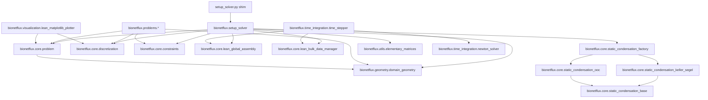
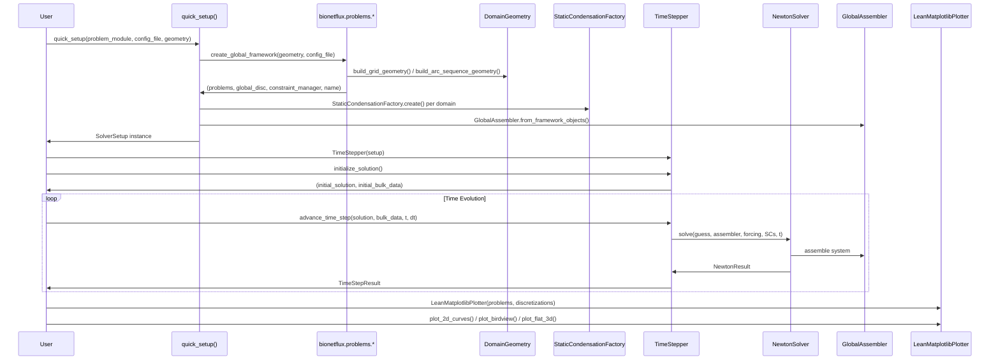

# BioNetFlux Code Structure Schematic

*Architecture overview with diagrams (updated 2026-04-03)*

## Directory Tree

```
BioNetFlux/
├── src/                            # Main source code directory
│   ├── setup_solver.py             # Backward-compatible shim
│   ├── bionetflux/                 # Core framework package (v1.0.0)
│   │   ├── __init__.py             # Package exports
│   │   ├── setup_solver.py         # SolverSetup, quick_setup()
│   │   ├── core/                   # Core mathematical components (14 files)
│   │   ├── geometry/               # Geometry management + maze data
│   │   ├── problems/               # Problem definitions (7 files)
│   │   ├── time_integration/       # TimeStepper, NewtonSolver
│   │   ├── utils/                  # Config, elementary matrices, mesh mapping
│   │   ├── visualization/          # LeanMatplotlibPlotter
│   │   └── analysis/               # Error evaluation
│
├── config/                         # TOML parameter files
├── tests/                          # Pytest test suite (21 files)
├── examples/                       # Example scripts (5 files)
├── docs/                           # Documentation
└── pyproject.toml                  # Project metadata
```

## Module Dependencies and Data Flow



## Key Components Overview

### Core Architecture (`bionetflux/core/`)

| Component | Purpose | Key Classes/Functions |
|-----------|---------|----------------------|
| `problem.py` | Problem definition and physics | `Problem` — validation, self-testing, factory |
| `discretization.py` | Finite element discretization | `Discretization`, `GlobalDiscretization` |
| `constraints.py` | Boundary/interface conditions | `Constraint`, `ConstraintType`, `ConstraintManager` |
| `lean_global_assembly.py` | Global system assembly | `GlobalAssembler` |
| `lean_bulk_data_manager.py` | Memory-efficient bulk data | `BulkDataManager` |
| `flux_jump.py` | Flux computation at interfaces | `domain_flux_jump()` |
| `domain_data.py` | Per-domain data container | `DomainData` |
| `boundary_override.py` | BC overrides from TOML | config-driven BC modification |
| `minimal_error_evaluator.py` | L2 error computation | `MinimalErrorEvaluator` |
| `static_condensation_base.py` | Abstract SC base | `StaticCondensationBase` |
| `static_condensation_factory.py` | SC factory | `StaticCondensationFactory.create()` |
| `static_condensation_keller_segel.py` | KS condensation | P0 flux for u, P1 for phi |
| `static_condensation_ooc.py` | OoC condensation | 4-equation system |

### Geometry System (`bionetflux/geometry/`)

| Component | Purpose | Key Features |
|-----------|---------|-------------|
| `domain_geometry.py` | Multi-domain network definition | `DomainGeometry`, `DomainInfo`, `ConnectionInfo` |
| | Connectivity analysis | `find_intersections()`, `validate_geometry()` |
| | Factory functions | `build_grid_geometry()`, `build_arc_sequence_geometry()`, `create_maze_geometry()` |
| `maze_*_data/` | Predefined maze topologies | CSV files (points.csv, lines.csv) |

### Time Integration (`bionetflux/time_integration/`)

| Component | Purpose | Key Classes |
|-----------|---------|------------|
| `time_stepper.py` | Time step coordination | `TimeStepper`, `AdaptiveTimeStepper`, `TimeStepResult` |
| `newton_solver.py` | Nonlinear solver | `NewtonSolver`, `NewtonResult` |

### Visualization (`bionetflux/visualization/`)

| Component | Visualization Modes | Use Cases |
|-----------|-------------------|-----------|
| `lean_matplotlib_plotter.py` | 2D curves (per domain) | Solution profiles |
| | Flat 3D view | Network topology with solution heights |
| | Bird's eye view | Network overview with color coding |
| | Comparison plots | Initial vs final states |
| | Geometry with indices | Domain/connection labeling |

### Problem Library (`bionetflux/problems/`)

| Problem Type | File | Description |
|-------------|------|-------------|
| **Organ-on-Chip** | `ooc_problem.py` | 4-equation microfluidic system |
| **OoC config** | `ooc_config_manager.py` | TOML parameter manager |
| **Keller-Segel** | `ks_problem.py` | 2-equation chemotaxis |
| **KS config** | `ks_config_manager.py` | TOML parameter manager |
| **Template** | `custom_problem_template.py` | User starting point |
| **Test** | `test_problem.py`, `test_problem2.py` | Single-domain test cases |

### Utilities (`bionetflux/utils/`)

| Component | Purpose |
|-----------|---------|
| `config_manager.py` | BaseConfigManager, TOML file loading |
| `elementary_matrices.py` | Reference element matrices (SymPy) |
| `mesh_mapping.py` | Coordinate transformations |

## Main Execution Flow



## Testing Framework

```
tests/
├── Core Tests
│   ├── test_core_smoke.py            # Basic import and initialization
│   ├── test_problem.py               # Problem class validation
│   └── test_geometry.py              # Geometry module validation
│
├── Component Tests
│   ├── test_bulk_data.py             # BulkData operations
│   ├── test_lean_bulk_data_manager.py # BulkDataManager
│   ├── test_compute_n_elements_from_h.py
│   ├── test_constraint_override.py   # Constraint overrides
│   ├── test_boundary_overrides.py    # BC overrides
│   ├── test_robin_jacobian.py        # Robin BC Jacobian
│   └── test_domain_flux_jump.py      # Flux jumps
│
├── Integration Tests
│   ├── test_lean_setup.py            # Full solver pipeline setup
│   ├── test_lean_global_assembly.py  # Global assembly pipeline
│   ├── test_static_condensation_setup.py
│   ├── test_flux_orders.py           # Flux polynomial orders
│   └── test_flux_error.py            # Flux accuracy
│
├── Specialized Tests
│   ├── test_maze_geometry.py         # Maze topology loading
│   ├── test_mass_monitoring.py       # Conservation verification
│   └── test_adaptive_time_stepping.py # Adaptive dt
│
└── Self-Testing (built into classes)
    ├── Problem.run_self_test()
    └── DomainGeometry.validate_geometry()
```

## Configuration and Extensibility

### Adding New Problem Types

1. Create new file in `bionetflux/problems/` (use `custom_problem_template.py` as starting point)
2. Implement `create_global_framework(geometry=None, config_file=None)` function
3. Use `DomainGeometry` for network definition
4. Set up physics via `Problem` class
5. Configure constraints via `ConstraintManager`
6. Optionally create a config manager subclass for TOML parameters

### Adding New Geometries

1. Use factory functions: `build_grid_geometry()`, `build_arc_sequence_geometry()`, `create_maze_geometry()`
2. Or build custom: `DomainGeometry.add_domain()` for segments, `.add_connection()` / `.add_exterior_boundary()` for topology
3. Validate with `validate_geometry()`

## File Relationships

```
bionetflux.setup_solver
├── Orchestrates entire framework initialization
├── Loads problems via importlib
├── Creates StaticCondensation per domain via factory
├── Builds GlobalAssembler from framework objects
└── Provides unified SolverSetup interface

bionetflux/core/
├── Foundation classes used by all components
├── No dependencies on problems/ or visualization/
└── Self-contained mathematical framework

bionetflux/problems/
├── Depends on core/ and geometry/
├── Defines specific physics and networks
├── Each implements create_global_framework()
└── Config managers handle TOML parameters

bionetflux/time_integration/
├── TimeStepper coordinates Newton + assembly
├── NewtonSolver handles nonlinear iteration
└── AdaptiveTimeStepper adds dt control

bionetflux/visualization/
├── Depends on core/ for data structures
├── Multiple visualization modes
└── Independent plotting capabilities
```
